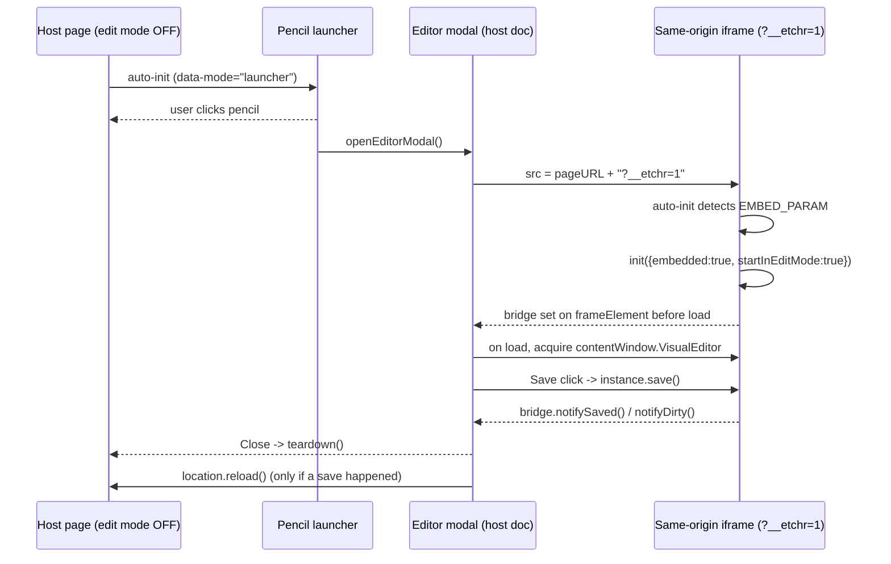

# Etchr

**Etchr** is a lightweight, embeddable, framework-free (vanilla JavaScript) **visual HTML/CSS editor**. Drop a single `<script>` tag onto any page and it becomes a live editing surface: hover to highlight elements, click to select, edit text in place, change fonts and styles, add or remove elements, edit CSS rules with specificity awareness, undo/redo everything, and save the result back to the source.

It is designed for two use cases:

1. **Standalone** — drop it on any static HTML page. By default it shows only a small pencil **launcher** button; clicking it opens the editor in a popup **modal** (the page reloaded in a same-origin iframe, running in edit mode), and saves write straight back to the `.html` file via a tiny Node/Express endpoint.
2. **Embedded in an app (e.g. React)** — render AI-generated or DB-stored HTML inside a same-origin `<iframe srcdoc>`, hand editing control to Etchr, and receive the cleaned HTML back through a `Promise`-based `onSave(html)` callback so your app can persist it wherever it likes (a DB row, an API, etc.). See [react_integration.md](react_integration.md) for a full walkthrough.

No build step is required to *use* it — just the bundled `dist/editor.js` and `dist/editor.css`.

---

## Features

- **Launcher + modal editing UX** — a single gradient pencil button is the only chrome injected into the host page; clicking it opens the editor in a framed popup (blurred backdrop, Save/Maximize/Close header) running against the same page in a same-origin iframe. Closing with unsaved changes prompts a Neo-Brutalist confirm dialog instead of silently discarding edits; saving reloads the host page once so it reflects what was written.
- **Select anything** — hover outline + click-to-select any element on the page.
- **Drag-to-resize with 8 handles** — the moment you select an element, eight resize handles (four corners + four edge midpoints) appear on its border. Drag any handle to freely resize the element; west/north handles keep the opposite edge visually anchored using margin compensation, so elements in normal document flow resize as you'd expect. Neighboring elements reflow live as you drag, and the whole gesture is a single undo step.
- **Drag-to-move (freeform canvas)** — drag the *interior* of a selected element (the border stays reserved for the resize handles) to move it anywhere on the page. On the first drag the element is promoted to an absolutely-positioned overlay in page coordinates — the PowerPoint-canvas model — so it lifts out of the document flow and can be placed over, or under, anything else. Frozen at its rendered size so it doesn't collapse, placement is pixel-exact regardless of page layout (see deep dive below), and the whole gesture is one undo step.
- **Layering (Bring to Front / Send to Back)** — right-click any element for a PowerPoint-style layering menu: **Bring to Front**, **Bring Forward**, **Send Backward**, **Send to Back**. Overlapping elements restack via `z-index` (statically-positioned elements are promoted to `position: relative` first so the change actually takes effect). Every command is a single undo step and serializes into the saved HTML. See the deep dive below for the exact stacking algorithm.
- **Auto-responsive CSS (background)** — resizing an element auto-authors the responsive CSS you'd otherwise write by hand: a `max-width: 100%` safety guard, `flex-wrap: wrap` on a flex parent when a child would overflow, and real `@media` breakpoint rules (tablet ≤768px, mobile ≤480px by default) that cap the element at its new size so the layout holds up on smaller screens. Repeated resizes update the same rules in place instead of piling up duplicates. Fully undoable and emitted into the saved HTML.
- **Inline text editing** — edit text content directly, plain-text-safe (no pasted markup leaks in).
- **Font & style panel** — change font family, size, color, weight, alignment, spacing, etc. live.
- **Describe-a-style box (plain English)** — type things like *"add a thick dashed black border on the right"* and Etchr turns it into CSS. No CSS knowledge required. Optionally route this to your own LLM endpoint via `onAiStyle` for smarter understanding.
- **Element-aware suggestions** — 10+ ready-made style presets tailored to the type of element you're editing (heading, button, image, input, container, link, list…).
- **Add / remove elements** — a collapsible right-side palette of HTML elements grouped by category; drop them into containers or after existing elements.
- **Image handling** — insert images by URL or local upload (embedded as a data URL, or routed through your own asset store via `onImageUpload`), then adjust size, shape, border, and gradients — all saved as CSS alongside the HTML.
- **CSS rule editor** — inspect and edit the actual stylesheet rules matching an element, with DevTools-style specificity; cross-origin sheets are shown read-only without errors.
- **Full undo / redo** — every operation (text, style, add/remove, CSS rule, batch multi-select) flows through a single history engine. `Ctrl+Z` / `Ctrl+Y` / `Ctrl+Shift+Z`.
- **Multi-select** — `Shift+click` to select several elements and batch-edit or delete them as one undoable step.
- **Clean save** — serialization strips all editor UI, helper classes, and bookkeeping attributes so the saved HTML is exactly your content and nothing of Etchr's.
- **Zero dependencies at runtime in the browser** — pure vanilla JS. Express is only used by the optional demo save-server.

---

## Repository structure

```
.
├── src/                     # ES-module source (bundled by esbuild)
│   ├── core/                # history engine, state, config, element-path, constants
│   ├── dom/                 # mode controller, selection overlay, text/style/attr mutators, element factory, keyboard shortcuts
│   ├── css/                 # rule matcher, specificity, stylesheet registry, css mutator, NL parser, suggestions
│   ├── ui/                  # toolbars, panels (style, css, quick-style, image, palette), launcher, editor-modal, confirm-dialog, icons, breadcrumb, toast
│   ├── serialize/           # clean-HTML serializer
│   ├── save/                # pluggable save client
│   └── index.js             # entry point + public API + auto-init
├── dist/                    # bundled output: editor.js (IIFE) + editor.css  (generated)
├── demo/
│   ├── demo.html            # standalone editable demo page (saves to disk)
│   └── iframe-embed-example.html  # simulates a host app embedding via iframe srcdoc + onSave callback
├── server/
│   ├── server.js            # Express: static serve + POST /save-page
│   └── save-page.js         # path-traversal-safe file writer
├── react_integration.md     # guide for embedding Etchr in a React app
├── esbuild.config.mjs       # build script (JS IIFE + CSS)
└── package.json
```

---

## How to run

### Prerequisites
- Node.js 18+ and npm.

### Install
```bash
npm install
```

### Build the bundle
```bash
npm run build      # produces dist/editor.js and dist/editor.css
# or, during development:
npm run watch      # rebuilds on source change
```

### Run the demo
```bash
npm run serve
```
Then open **http://localhost:5173/demo.html**.

- Click the pencil **launcher** button (top-right corner) to open the editor popup.
- Hover to highlight, click to select, and use the toolbar/panels to edit.
- Click **Save** in the popup header (or `Ctrl+S`) to write your changes back to `demo/demo.html`.
- Click **Close** (or `Escape`) to dismiss the popup; if there are unsaved changes you'll be asked to confirm.

> Tip: after rebuilding, hard-refresh the browser (`Ctrl+Shift+R`) to bypass the cached bundle.

To try the embedded-host flow (iframe + `onSave` callback), open **http://localhost:5173/iframe-embed-example.html**.

---

## How to use it in your own page (standalone)

Build once, then include the two artifacts. Etchr auto-initializes on load.

```html
<link rel="stylesheet" href="/dist/editor.css" />
<script src="/dist/editor.js" data-save-endpoint="/save-page"></script>
```

- `data-save-endpoint` — where the raw edited HTML is POSTed (`Content-Type: text/html`). Defaults to `/save-page`.
- `data-auto-init="false"` — disable auto-init if you want to call `VisualEditor.init(...)` yourself.

You'll need a server route that accepts the saved HTML. The included `server/save-page.js` shows a safe implementation (rejects path traversal, only writes `.html`/`.htm`).

### Launcher vs. inline mode

Auto-init reads `data-mode` off the `<script>` tag:

| `data-mode` | Behavior |
|---|---|
| `launcher` (default) | Injects only the pencil button. Editing happens in the popup modal (see below); the host page itself is never put into edit mode. |
| `inline` | The pre-v4 behavior — the editor runs directly on the page itself (toolbar, panels, and all), no popup. |
| `off` | Same as `data-auto-init="false"`: nothing runs until you call `VisualEditor.init(...)` yourself. |

```html
<script src="/dist/editor.js" data-mode="inline"></script>
```

If you want a custom trigger instead of the built-in pencil button, use `data-mode="off"` and call `window.VisualEditor.openEditor()` from your own button's click handler.

---

## Architecture: the launcher + modal flow



- **Same origin, no `postMessage`.** The modal's iframe loads the *same page* with a `?__etchr=1` query flag (`EMBED_PARAM`, `src/core/constants.js`), so the host can call `iframe.contentWindow.VisualEditor` directly once the frame loads.
- **The bridge is one-way iframe → host**, set as an expando (`iframe.__etchrBridge`) *before* `src` is assigned, so it's guaranteed to exist by the time the iframe's own auto-init reads `window.frameElement.__etchrBridge`. It carries three calls: `requestClose()` (Escape with nothing else to dismiss), `notifyDirty(bool)` (highlights the modal's Save button), and `notifySaved()` (tells the host a reload is warranted on close).
- **Dirty tracking** compares `state.currentIndex` against a new `state.savedIndex` (set on every successful save) — undoing back to the last-saved point counts as clean again. An in-progress `contenteditable` session is conservatively treated as dirty even before it commits.
- **Embedded config.** Inside the iframe, `init()` is called with `embedded: true`, `startInEditMode: true`, `paletteSide: 'left'`, `confirmBeforeSave: false` (the modal's own Save click is already a deliberate action), and `allowModeToggle: false` (there's no page to "exit editing" back to inside a popup).

---

## How to use it inside an app (React / iframe)

Etchr isolates the edited document from your app's DOM and styles by living inside a **same-origin `<iframe srcdoc>`**. The bundle is loaded *inside* that iframe, so `VisualEditor` exists on the iframe's `contentWindow`.

1. Fetch your HTML (e.g. AI-generated, stored in a DB by id) and build an iframe whose `srcdoc` contains that document plus, in its `<head>`/end of `<body>`:
   ```html
   <link rel="stylesheet" href="https://your-cdn/dist/editor.css" />
   <script src="https://your-cdn/dist/editor.js" data-auto-init="false"></script>
   ```
2. When the user clicks **Edit**, initialize with your save callback:
   ```js
   iframe.contentWindow.VisualEditor.init({
     startInEditMode: true,
     onSave: async (html) => {
       // html is fully cleaned — no editor artifacts.
       await saveTemplate(id, html);   // your DB/API call
       // resolving = success toast; throwing/rejecting = error toast
     },
   });
   ```
3. Saving inside the framework (Save button or `Ctrl+S`) runs your `onSave`. The returned Promise **is** the report-back channel: resolve → success toast; reject → error toast showing the message. No separate event bus needed.

Because it's same-origin, you can pass a real function reference directly to `init` — no `postMessage` plumbing required.

---

## Public API

`window.VisualEditor` (the global; `VisualEditor` inside an iframe host):

| Method | Description |
|--------|-------------|
| `init(options)` | Initialize the editor (idempotent — returns the existing instance if already inited). Returns the instance. |
| `getState()` | Current editor state (selection, history, edit-mode flag…). |
| `getInstance()` | The live instance object (or `null` if not initialized) — the same value `init()` returns. |
| `isDirty()` | `true` if there are unsaved changes (or an in-progress text edit) since the last successful save. |
| `openEditor()` | Programmatically open the launcher's popup modal — useful with `data-mode="off"` and your own trigger button. |

The instance returned by `init()` also exposes: `undo()`, `redo()`, `save()`, `getCleanHTML()`, `getState()`, and `destroy()`.

### `init(options)`

| Option | Type | Default | Description |
|--------|------|---------|-------------|
| `document` | `Document` | `document` | The document to edit (pass the iframe's document if initializing from outside). |
| `onSave` | `(html) => Promise` | `null` | Custom save handler. If set, replaces the POST-to-endpoint behavior. Resolve = success, reject/throw = error. |
| `saveEndpoint` | `string` | `'/save-page'` | Where to POST raw HTML when no `onSave` is given. |
| `onImageUpload` | `(File) => Promise<string url>` | `null` | Route local image uploads to your asset store. Falls back to an inline data URL. |
| `onAiStyle` | `(text, {tag, currentStyles}) => Promise<{property,value}[]>` | `null` | Route the "describe a style" box to your own LLM for true NL understanding. Falls back to the built-in phrase parser. |
| `confirmBeforeSave` | `boolean` | auto | Show a native confirm before saving. Defaults to `true` only for the file-write path. |
| `startInEditMode` | `boolean` | `false` | Enter edit mode immediately on init. |
| `embedded` | `boolean` | `false` | Marks this instance as running inside the editor-modal iframe: trims in-page chrome (no Enable/Exit toggle, no in-page Save button — the modal header owns saving). Set automatically when auto-init detects `?__etchr=1`; you shouldn't normally set this by hand. |
| `paletteSide` | `'right' \| 'left'` | `'right'` | Which screen edge the elements palette docks to. |
| `allowModeToggle` | `boolean` | `true` | Set `false` to remove the Enable/Exit editing toggle and its `Ctrl+E` shortcut (used in embedded mode, where exiting edit mode is a dead state). |
| `debounceMs` | `number` | `150` | Debounce for CSS rescans on selection change. |
| `fontFamilies` / `googleFonts` | `string[]` | built-in lists | Customize the font pickers. |
| `enableResize` | `boolean` | `true` | Show the 8 drag-to-resize handles on the selected element. Set `false` to disable resizing entirely. |
| `enableMove` | `boolean` | `true` | Allow dragging a selected element's interior to move it anywhere (promotes it to an absolutely-positioned, page-coordinate overlay). Set `false` to keep elements pinned in normal document flow. |
| `enableLayering` | `boolean` | `true` | Show the right-click layering menu (Bring to Front / Send to Back / Bring Forward / Send Backward) that restacks overlapping elements via `z-index`. Set `false` to disable it. |
| `autoResponsiveCss` | `boolean` | `true` | Whether resizing auto-injects reflow fixes + `@media` breakpoint rules. Set `false` to record only the raw width/height change. |
| `resizeMinSize` | `number` | `24` | Minimum width/height (px) a drag can shrink an element to. |
| `responsiveBreakpoints` | `string[]` | `['tablet', 'mobile']` | Which breakpoint tiers to generate on resize. `tablet` = `(max-width: 768px)`, `mobile` = `(max-width: 480px)`. Pass `[]` to keep the same-viewport reflow fixes but skip `@media` generation. |

---

## Keyboard shortcuts

| Shortcut | Action |
|----------|--------|
| `Ctrl+E` | Toggle edit mode |
| `Ctrl+Z` | Undo |
| `Ctrl+Y` / `Ctrl+Shift+Z` | Redo |
| `Ctrl+S` | Save |
| `Shift+Click` | Add/remove element from multi-selection |
| `Drag a resize handle` | Resize the selected element (corner = both axes, edge = one axis); auto-generates responsive CSS |
| `Drag the element interior` | Move the selected element anywhere on the page (freeform absolute positioning) |
| `Right-click an element` | Open the layering menu: Bring to Front / Bring Forward / Send Backward / Send to Back |
| `Escape` | Close the layering menu / open panel / palette, or clear selection |

---

## Drag-to-move & layering — implementation deep dive

These are the two most recently added interactions (v3.0.0). Both build on the same undoable-history engine as everything else, but each has non-obvious mechanics worth documenting in full.

### Drag-to-move (`src/dom/move-controller.js`)

1. **Arming.** The moment a single element is selected, a transparent `moveSurface` div (`src/dom/selection-overlay.js`) is positioned over its interior, just *below* the 8 resize handles in z-order — so edge/corner drags still resize, and only the interior initiates a move. The surface is never shown for the root element (`<body>`), anything that contains the root (e.g. `<html>`), a detached node, or a multi-selection — reparenting any of those would throw or make no sense, so plain click-to-select still works there.
2. **Threshold.** Pointer travel under 3px (`DRAG_THRESHOLD`) is treated as a plain click, not a drag — `forwardClick()` temporarily hides the surface, uses `elementFromPoint` to find what's actually under the cursor, and forwards the selection (respecting `Shift+Click` for multi-select) so you can still click through to a nested child.
3. **Promotion (first real drag frame only).** The element is frozen at its exact rendered `width`/`height`, `box-sizing` is forced to `border-box`, all four margin *longhands* are zeroed individually (not the `margin` shorthand — an element that was previously resized may have asymmetric `margin-left`/`margin-top` longhands set, and the shorthand would silently wipe them), and `position` becomes `absolute`. If it isn't already a direct child of the root, it's reparented there (`root.appendChild(t)`) so it floats above the entire document flow and can overlap anything — the PowerPoint-canvas model.
4. **Measure-and-correct coordinate math.** An absolutely-positioned element is placed relative to its containing block's *padding box* — which is **not** the viewport origin whenever the containing block is centered (e.g. `body { margin: auto }`) or itself positioned. Rather than compute that offset analytically, `promote()` sets a provisional `left/top: 0px`, reads where the element actually landed via `getBoundingClientRect()`, and derives `baseLeft`/`baseTop` as the delta needed to put it back at the exact viewport position it was grabbed at. Every subsequent frame just adds the pointer delta to that base — so placement is pixel-exact regardless of page layout, and there's no rightward/downward drift on repeated moves.
5. **Live preview.** Every `pointermove` frame calls `previewStyle()` (inline-only, no history entry) and re-runs `overlay.showSelectedMany()` so the outline, resize handles, and move surface stay glued to the live rect.
6. **Commit (`pointerup`).** All promoted styles are reverted to their captured originals and the node is moved back to its exact original DOM slot *first* — this makes the subsequent history batch a clean, self-contained description rather than a diff against mutated state. Then: the original element path is read, and if the element left its original parent, a `move-element` change (see below) plus the full set of `set-style` changes (position/left/top/size/margin/box-sizing) are bundled into one `batch` — a single `Ctrl+Z` undoes the entire gesture, restoring the element to normal flow.
7. **`move-element` history entries.** A new change type in `src/dom/dom-mutator.js`. Unlike most changes (which re-render from serialized state), `reparentByPath()` relocates the *live* DOM node — `node.remove()` then `toParent.insertBefore(node, refNode)` — so an in-progress selection, resize, or open panel survives the reparent across undo/redo instead of being invalidated by a fresh clone.

### Layering (`src/dom/layer-mutator.js`)

- **Peers = editable siblings.** Layering only ever restacks an element against `getEditableChildren(el.parentElement)` — the elements it can actually paint-overlap. (Moving is what brings unrelated elements into the same stacking context in the first place.)
- **`effectiveZ(el)`** reads `getComputedStyle(el).zIndex` and treats `'auto'` or any non-numeric value as `0`.
- **Static→relative promotion.** `z-index` has no effect on a statically-positioned box, so if the target is `position: static`, it's first promoted to `position: relative` (not `absolute`, unlike the move gesture — this keeps it in normal flow while making stacking take effect).
- **Bring to Front / Send to Back** jump past every peer in one step: new `z-index` = `max(peers) + 1` or `min(peers) - 1`. A no-op is skipped (no history entry) if the element is already strictly above/below every peer.
- **Bring Forward / Send Backward** move exactly one step. All peers (including the target) are sorted into the actual paint-order stack — ascending `z-index`, with DOM order breaking ties (a later sibling paints on top at equal `z-index`, matching real browser behavior) — and the target swaps `z-index` with its immediate neighbor in that stack. If the neighbor is tied with the target on `z-index` (so a literal swap wouldn't be visible), the target is nudged ±1 past it instead.
- **One undo step.** Every command is expressed as `set-style` descriptors (reusing the existing history handler — no new change type was needed) bundled into a single `batch`, and it's included verbatim when the HTML is saved.

### Right-click context menu (`src/ui/context-menu.js`)

- Right-clicking any non-editor element (in edit mode) selects it — if it wasn't already selected — and opens a 4-item menu (**Bring to Front**, **Bring Forward**, **Send Backward**, **Send to Back**) at the cursor, clamped so it never spills past the viewport edge.
- Right-clicking the transparent move surface is treated as a right-click on the underlying selected element (rather than being swallowed as editor chrome), since the surface visually sits on top of it.
- The menu dismisses on any outside `pointerdown`, on `scroll`/`resize`, or on `Escape` — which it consumes (`stopPropagation`) so the same keypress doesn't also fall through to the app's own close-panel/clear-selection `Escape` chain.
- The menu is layering-only by design; **Edit text** / **Delete** remain on the floating per-element toolbar, not duplicated here.

---

## How it works (architecture notes)

- **Single source of truth for mutations.** Every undoable change (`text-edit`, `set-style`, `add-element`, `remove-element`, `move-element`, `edit-css-rule`, `add-css-rule`, `add-media-rule`, `insert-css-rule`, `set-attribute`, `batch`) is described as data and applied through one `addChange()` / `undo()` / `redo()` engine (`src/core/history.js`). UI modules never mutate the DOM directly — they compute old/new values and dispatch a change. This keeps undo/redo provably consistent.
- **Move = reparent + restyle, atomically.** A drag-to-move gesture emits one `batch` bundling a `move-element` (which relocates the *live* node — not a re-parsed clone — so selections survive undo/redo) and the `set-style`s that make it an absolutely-positioned overlay. Layering commands are pure `set-style` `z-index` batches.
- **Composed batches for resize.** A single resize gesture emits one `batch` bundling the width/height/margin changes, the reflow fix, the stable-class assignment, and every `@media` rule — so the whole gesture (visual resize *and* the responsive CSS authored in the background) undoes and redoes atomically.
- **CSSOM rules are materialized on save.** Rules added via `insertRule()` live only on the live stylesheet object, so the serializer writes each editor-created sheet's current `cssRules` back into its `<style>` element before emitting the clean HTML — otherwise CSS-editor and auto-responsive rules would serialize as an empty `<style>`.
- **Positional element paths.** Elements are addressed by an array of child-element indices from the root (`src/core/element-path.js`), skipping editor-owned nodes and text-node whitespace, so paths stay valid across a linear history.
- **All UI is contained.** Every injected element lives under `#vve-root` (marked `data-vve-ignore`) and uses a `vve-` class prefix, so save-time stripping is a single subtree removal plus attribute cleanup.
- **Clean serialization.** `src/serialize/html-serializer.js` clones the document, removes the editor subtree, strips bookkeeping attributes/classes, and returns exactly your content.

---

## Limitations

- Path stability assumes all DOM mutation goes through Etchr's history engine; a host page's own scripts mutating the editable region during edit mode is out of scope.
- Inline text editing commits plain text only.
- Shadow DOM content and true cross-origin iframes are out of scope (the script can't be injected into a document it doesn't control). Same-origin iframes are fully supported.
- Auto-responsive breakpoints use a conservative `width: 100%` + `max-width: <resized>px` cap rather than simulating a narrower viewport (which isn't possible against the live host document), so they only ever shrink an element relative to its authored desktop size. Fine-tune the generated rules in the CSS panel if you need different behavior at a breakpoint.
- Resize handles target a single selected element; multi-select resizing is out of scope.
- Drag-to-move promotes an element to `position: absolute` and reparents it to `<body>` for true page-global coordinates. Because it leaves its original container, descendant-based CSS (e.g. `.card > .title { … }`) no longer matches it — restyle via the CSS panel if you rely on such rules. Absolute placement uses fixed pixel coordinates, so moved elements are not auto-made-responsive the way resizing is.
- Layering targets a single element and restacks it only against its own siblings (the elements it can actually overlap); moving is what brings elements into a shared stacking context.
- The launcher + modal flow relies on the page being reachable at a stable, same-origin URL (it reloads the current page into an iframe with `?__etchr=1` appended) — it isn't used for the React/iframe-srcdoc integration path, which stays as documented above.

---

## Version history

- **v4.0.0** — Launcher + modal editing UX: standalone embeds now default to a pencil-button launcher (`data-mode="launcher"`) that opens editing in a popup modal, rather than putting the whole host page into edit mode inline. Added a same-origin iframe reload flow with a host↔iframe bridge (`src/ui/editor-modal.js`), a Neo-Brutalist unsaved-changes confirm dialog (`src/ui/confirm-dialog.js`), and an inline-SVG icon set (`src/ui/icons.js`). New config: `embedded`, `paletteSide`, `allowModeToggle`; new public API: `getInstance()`, `isDirty()`, `openEditor()`; new `data-mode` script attribute (`launcher` / `inline` / `off`) replacing the old always-inline behavior (still available via `data-mode="inline"`). Added `state.savedIndex` for dirty tracking. Added [react_integration.md](react_integration.md), a dedicated guide for embedding Etchr in a React app. See [Architecture: the launcher + modal flow](#architecture-the-launcher--modal-flow) above.
- **v3.0.0** — Freeform drag-to-move (`enableMove`) and PowerPoint-style layering with a right-click context menu (`enableLayering`): Bring to Front / Bring Forward / Send Backward / Send to Back. New `move-element` history change type; new config options `enableMove` and `enableLayering`. See [Drag-to-move & layering — implementation deep dive](#drag-to-move--layering--implementation-deep-dive) above.
- **v2.0.0** — Drag-to-resize with 8 handles (`enableResize`) and auto-generated responsive CSS on resize (`autoResponsiveCss`, `resizeMinSize`, `responsiveBreakpoints`).
- **v1.0.0** — Initial release: selection, inline text editing, font/style panel, describe-a-style (NL → CSS), element-aware suggestions, add/remove elements palette, image handling, CSS rule editor, full undo/redo, multi-select, clean save.

---

## License

MIT (see `LICENSE` if present, or add one before publishing).
